  

📌 About Me
Currently learning Data Structures & Algorithms in Java

Passionate about building scalable software and real-world applications

Interested in Backend Development, System Design, and Problem Solving

Open to collaborating on Open Source & Development Projects

Fun fact: I enjoy solving coding problems and improving algorithmic thinking

🧠 My Focus Areas
Master Data Structures & Algorithms
Build Full Stack Projects
Contribute to Open Source
Prepare for SDE roles

📊 GitHub Stats & Trophies

  
  

  

  

🛠️ Languages & Tools
<h3 align="center">Programming Languages</h3>

  &nbsp;
  &nbsp;
  &nbsp;
  

<h3 align="center">Backend</h3>

  

<h3 align="center">Database</h3>

  &nbsp;
  

<h3 align="center">DevOps & Cloud</h3>

  

<h3 align="center">Tools</h3>

  &nbsp;
  

  

 
🔗 Connect with Me

  &nbsp;&nbsp;
  

  

